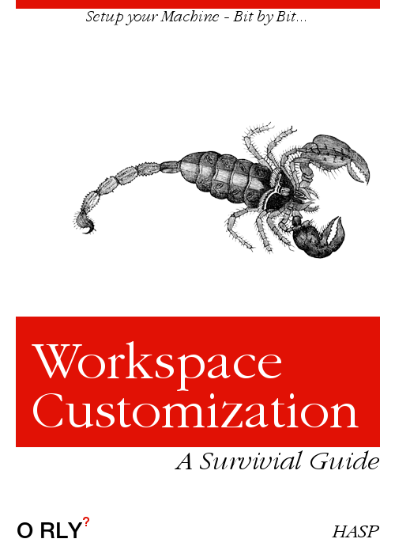

# LiTec Workspace Setup Information

A repository to present all relevant information for IT (and maybe other) students of the Linzer Technikum (LiTec) to setup their personal workspace on their computers.

> The following guide has its main focus on a setup of Windows 10 machines / workstations! MacOS or linux users have to use different package managers (Mac: brew/homebrew, linux: apt, rpm, pacman,...) and install routines (and you are going to have trouble to use Visual Studio... ).

> :warning: **DISCLAIMER! The author of this guide takes no responsibility for what may happen to your system! Run scripts at your own risk! Understand and double check on what you are doing!**

## Overview

The typical IT student of the Linzer Technikum is going to use the following tools in his career:

1. Packagemanager: [chocolatey](https://chocolatey.org/install) 
   - :warning: **This tool is used to install ALL software that we need!**
   - **So don't start to download any executables / installers from webpages!**
2. Markdown editor: [Typora](https://typora.io/)
3. General purpose editor (also good for markdown): [Visual Studio Code](https://code.visualstudio.com/)
   - This editor is going to be our "swiss army knife"  - **GET USED TO IT!**
4. Version Control System (VCS): [git](https://git-scm.com/) (versioning tool) and [github](https://github.com/) (SaaS - Software as a Service)
5. Java development IDE: [IntellijIdea Community](https://www.jetbrains.com/idea/)
6. C# development IDE: [Visual Studio](https://visualstudio.microsoft.com/)
7. Microcontroller: [Arduino](https://www.arduino.cc/)
8. Android: [Android Studio](https://developer.android.com/studio/)
9. Containerization: [Docker](https://www.docker.com/) and [Docker Desktop](https://www.docker.com/products/docker-desktop)

> this list is definitely not fully populated! Just the most important tools are mentioned here.

---

## Mandatory Basic Knowledge

### "Elevated PowerShell Console"

If you read anywhere within the text a phrase like *"open a powershell console as administrator"*, *"start an elevated powershell console"*, or *"within an elevated powershell console"*, then you need to perform the following steps:

1. Right Click on the Windows Start-Menu Icon - normally positioned at the bottom left of your Windows 10 system.
2. Choose `WindowsPowerShell (Admin)` entry of the context menu.
3. Click on `Yes`.
4. DONE!

**Alternative:**

- Open the search field, type in `powershell` and choose `Run as Adminstrator`.

---

## Setup

1. Start with [Chocolatey setup](./setup/00_ChocoInstall.md) - the installation guide for the package manager.
   - It also contains information about the base packages everyone needs (e.g. Typora and vscode).
2. After that it depends on the grade you are in:
   - **2nd grade students** perform all steps of the following documents:
     - [Git and github setup](./setup/01_GitSetup.md)
     - [Visual Studio setup](./setup/02_VisualStudioSetup.md)
   - **3rd grade students**:
     - check if you got all from 2nd grade, and additionally
     - [Visual Studio Code setup](./setup/03_VsCodeSetup.md)
     - [Java Development Setup](@tbd) **@tbd**
     - [Arduino Setup](@tbd) **@tbd**
   - **4th and 5th grade students** 
     - check if you got all from the previous years and then perform
     - [Android Development Setup](@tbd) **@tbd**
     - [Docker Setup](@tbd) **@tbd**

## Additional Content and Recommendations

Some recommended links to various topics:

- Windows 10 App cleanup: [Windows10Debloater](https://github.com/Sycnex/Windows10Debloater)
- @tbd more stuff might follow...