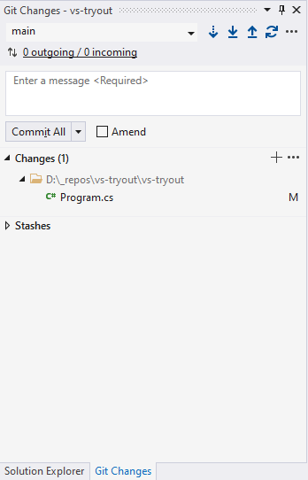
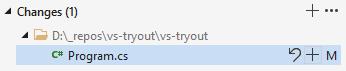
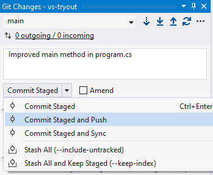

# Git in Visual Studio 2019

Usage of git within Visual Studio.

3 Steps (add some smaller ones to that list) to success.

---

## Step 1 - Clone your Git Repository

1. Log in to <https://github.com>, open up your repository and click on teh green Button `Code` .
1. Select the **FULL** link (or click on the clipboard art right of it).
1. Open up a bash or command line in your repository folder - for example `C:\_repos\` .
1. Type `git clone <your_repo_link>`  and wait for the download to finish

---

## Step 2 - Creating a VS Project within Your Git Repository

1. Open up Visual Studio 2019
1. Create a new Solution and set the location of the solution **WITHIN** the repository folder.
1. And here we go! You have set up version control within Visual Studio! (At least if you have the git plugins installed!)

> Alternative to Step 1 and 2: directly open remote repository within Visual Studio:
> `Menu -> File -> Clone or Checkout Code`
> Works well if you already have a VS solution within the remote repository!

---

## Step 3 - Working with Git within VS

> We will use `Git changes`, but it is also possible to work with the `Git` Menu-Entry or the `Team-Explorer`.

1. The `Git Changes` tab is to found right beside the Solution Explorer tab.
    - If it is not visible use `Menu -> View -> Git Changes`
    - or use shortcuts: `Ctrl+0` or `Ctrl+G`
1. Open up the `Git Changes` tab and you get a view similar to this:

3. Now have a look at the area in the center with the text `Changes` - right below is a list of all files that have new content (differ from git versioned file). 

   *In this example just one file has changes: `Program.cs`. There is an `M` right of it which stands for **M**odified.*

4. **ADD**: (staging files)

   - If you want to `add` all files to the git stage, just click on the `+` right of `Changes`.
   - If you want to select single files hover with your mouse over it and then click the appearing `+`-sign.

5. **COMMIT**: (versioning files)
   - Enter a commit message in the text area at the top (something short that describes the latest changes)
   - Then select the drop-down menu of the `Commit Staged`-Button and chose `Commit Staged and Push`

6. **PUSH**: (send changes to github) - and **PULL**

   - Push step was already performed by selecting the `Commit Staged and Push`-Button.

   - But have a look at the top of the `Git Changes` Tab - you will find some Icons there. 

   - From left to right: fetch / pull / push / sync and a context menu with even more choices... 

     

---

